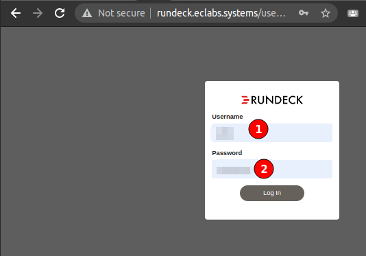
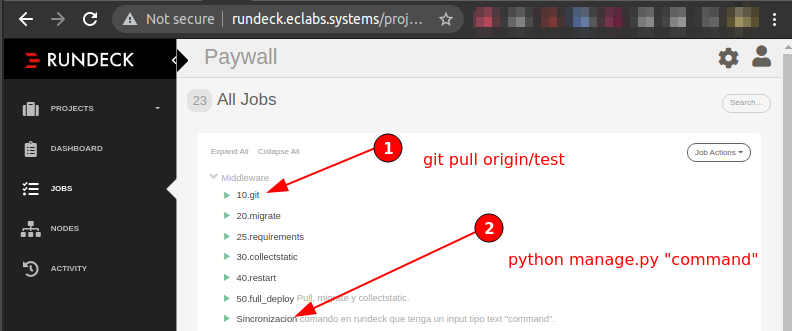
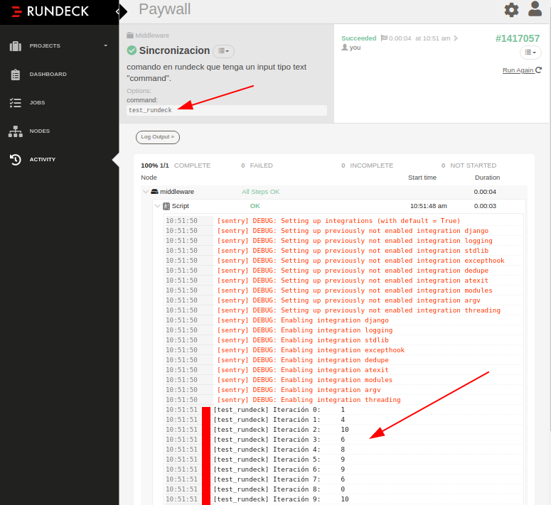

# Paywall • Middleware

Middleware basado en django.

## Tareas programadas

```
00 */6 * * * /apps/middleware/env/bin/python3 /apps/middleware/src/manage.py load_first_logins
00 */3 * * * /apps/middleware/env/bin/python3 /apps/middleware/src/manage.py load_report_arc --hoursAgo 4 --site "gestion"
10 */3 * * * /apps/middleware/env/bin/python3 /apps/middleware/src/manage.py load_report_arc --hoursAgo 4 --site "elbocon"
20 */3 * * * /apps/middleware/env/bin/python3 /apps/middleware/src/manage.py load_report_arc --hoursAgo 4 --site "depor"
30 */3 * * * /apps/middleware/env/bin/python3 /apps/middleware/src/manage.py load_report_arc --hoursAgo 4 --site "trome"
40 */3 * * * /apps/middleware/env/bin/python3 /apps/middleware/src/manage.py load_report_arc --hoursAgo 4 --site "peru21"
59 */3 * * * /apps/middleware/env/bin/python3 /apps/middleware/src/manage.py load_report_arc --hoursAgo 4 --site "elcomercio"
```

## Requerimientos

- Python 3.7.3+
- Postgresql

## Instalación

El middleware puede instalarse en localhost. Sin embargo, se suele trabajar con el servidor de desarrollo que obtiene los commits de la rama `test`. 🔴 Los servidores de producción obtienen los commits de la rama `master`.

### Buenas prácticas

- 🔴 Crear nuevas ramas para trabajar con `test` o `master`
- 🔴 No realizar force-push en las ramas `test` o `master`.

### Localhost - Linux (Ubuntu 20.04+)

1. Instalar `postgresql` (BD), `pgadmin` (gui BD)

   ```bash
   # Depende del sistema operativo, ver https://www.postgresql.org/download/
   sudo apt-get -y install postgresql
   ```

2. Setear base de datos

   ```bash
   # Solo para nuevas instalaciones
   sudo apt-get -y install postgresql
   sudo su postgres # cambiar de usuario a postgres
   # aquí la terminal abre la CLI de la base de datos
   # Ingresar al command line interface de postgres
   psql
   ```

3. Ejectar línea por línea comandos dentro de postgresql

   ```sql
   /* Crea base de datos con ese nombre */
   CREATE DATABASE basededatoslocal;
   /* Cambiar contraseña del admin de la base de datos */
   ALTER USER postgres PASSWORD 'postgresqlpassword';
   /* Salir de SQL-CLI */
   \q

   /* CIERRA LA TERMINAL Y ABRE OTRA */
   ```

4. [🟡OPCIONAL] Setear entorno virtual para evitar conflictos de dependencias.

   ```bash
   ...
   ```

5. Instalar `psycopg2` (driver para conectar python con la BD) <br>

   ```bash
   pip3 install -r requirements-dev.txt
   ```

6. Edita la plantilla con tus configuraciones en local y ejecuta el script

   ```bash
   # Linux terminal
   echo """
   RECAPTCHA_PRIVATE_KEY = '' # Completar si es necesario
   RECAPTCHA_PUBLIC_KEY = '' # Completar si es necesario
   SENTRY_DNS = '' # Completar si es necesario
   PAYWALL_ARC_TOKEN = '' # Completar si es necesario
   PAYWALL_ARC_URL = '' # Completar si es necesario
   DATABASES = {
       'default': {
           'ENGINE': 'django.db.backends.postgresql_psycopg2',
           'NAME': 'basededatoslocal', # editar con la configuración en local
           'USER': 'postgres', # editar con la configuración en local
           'PASSWORD': 'postgresqlpassword', # editar con la configuración en local
           'HOST': 'localhost', # default
           'PORT': '5432', # default
       }
   }
   TIME_ZONE = 'America/Lima'
   PAYWALL_ARC_PUBLIC_URL = 'https://api-sandbox.gestion.pe/'
   ENVIRONMENT = 'test' # *default='test'
   DEBUG=True

   """ >> ./src/project/local_settings.py
   ```

7. Migra los modelos a la base de datos con:

   ```bash
   python src/manage.py migrate
   ```

> Pueden salir errores de migración. Además, dependiendo de la versión de python, puedes ejecutar:
>
> - Intérprete por defecto de python2 y 3: `python`
> - Intèrprete en específico: `python3.7`
> - Intérprete por defecto de python3: `python3`


> Hay errores basados en el nombre "ubigeo", estos son porque la versión de django gestiona diferente un campo llamado `name` en las clases, solo necesitas cambiar los names de "ubigeo" a "apps.ubigeo" y reintentar para las apps que salga el mensaje.

8. Acopiar estáticos

   ```bash
   python src/manage.py collectstatic
   ```

> Pueden salir errores, continúa.

9. Crea un super usuario para el django-admin, ingrese línea por línea según pida la consola

   ```bash
   # Con estas credenciales te logeas en el django/admin
   python src/manage.py createsuperuser
   djangoadminlocal
   djangoadminlocal@example.com
   djangoadminlocalpassword
   djangoadminlocalpassword
   ```

<!-- 7. Edita el archivo [src/project/settings.py](src/project/settings.py)

    ```diff
    - DEBUG = False
    + DEBUG = True
    ``` -->

10. Ejecuta el servidor en modo local con una de las líneas e ingresa con las credenciales creadas arriba `djangoadmin...`

   ```bash
   python src/manage.py runserver # O python manage.py runserver
   ```

   > Algunos IDEs como Visual Studio Code necesitan abrir el folder en la carpeta `src` para poder ejecutar comandos correctamente. Es decir, en lugar de `src/manage.py` ejecutar `manage.py`.
   > Agrega usuarios en tu local para poder probar scripts.

## Despliegue en Rundeck [dev]

1. Inicia sesión en tus credenciales de [Rundeck](http://rundeck.eclabs.systems/user/login)

   

2. Elije el proyecto y luego en el panel izquierdo elige el apartado "Jobs". Luego accederas a un panel donde operas el servidor mediante comandos predeterminados. En el caso de trabajar la rama `test` de este repositorio que se despliega en [devarc.comerciosuscripciones.pe](http://devarc.comerciosuscripciones.pe/admin/) debes correr el comando predeterminado `10.git` y `Sincronización`.

   

   > Por ejemplo, en el caso de Sincronización, prueba el comando `test_rundeck`, que itera e imprime 10 números al azar de entre 0 y 10.

   

   > Los errores son enviados también por [Sentry](https://sentry.ec.pe/)

3. Revisa [devarc.comerciosuscripciones.pe](http://devarc.comerciosuscripciones.pe/admin/) para ver los cambios.
